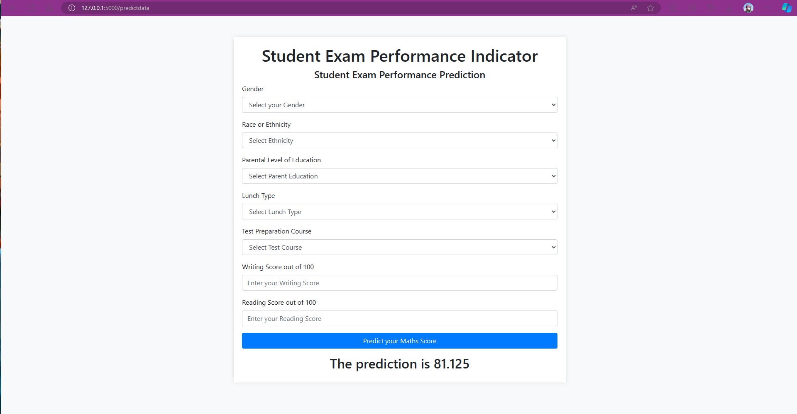

# Students Performance in Exams

### Introduction About the Data :

**The dataset** The goal is to predict `Math Score` of given Student.

There are 7 independent variables:

* `gender` : This column indicates the gender of each student, with values such as "female" or "male."
* `race_ethnicity` : Represents the race or ethnicity of the students and is categorized into groups, denoted by labels like "group B" or "group C."
* `parental_level_of_education` : Specifies the highest level of education attained by the student's parents, using categories such as "bachelor's degree" or "master's degree."
* `lunch` : Describes the type of lunch the student receives, categorized as "standard" or possibly "free/reduced," which could be indicative of socioeconomic status.
* `test_preparation_course` : Indicates whether the student completed a test preparation course, with values like "none" or "completed," providing insights into their preparation for standardized tests.
* `reading_score` : Contains numerical values representing the student's score in the reading section of an assessment.
* `writing_score` :Contains numerical values representing the student's score in the writing section of an assessment.

Target variable:
* `Math Score`: Math Score of the given Student.

Dataset Source Link :
[https://www.kaggle.com/datasets/spscientist/students-performance-in-exams](https://www.kaggle.com/datasets/spscientist/students-performance-in-exams)

# Screenshot of UI

# Approach for the project 

1. Data Ingestion : 
    * In Data Ingestion phase the data is first read as csv. 
    * Then the data is split into training and testing and saved as csv file.

2. Data Transformation : 
    * In this phase a ColumnTransformer Pipeline is created.
    * for Numeric Variables first SimpleImputer is applied with strategy median , then Standard Scaling is performed on numeric data.
    * for Categorical Variables SimpleImputer is applied with most frequent strategy, then ordinal encoding performed , after this data is scaled with Standard Scaler.
    * This preprocessor is saved as pickle file.

3. Model Training : 
    * In this phase base model is tested . The best model found was catboost regressor.
    * After this hyperparameter tuning is performed on all the model.
    * This model is saved as pickle file.

4. Prediction Pipeline : 
    * This pipeline converts given data into dataframe and has various functions to load pickle files and predict the final results in python.

5. Flask App creation : 
    * Flask app is created with User Interface to predict the Math Score of a student inside a Web Application.
